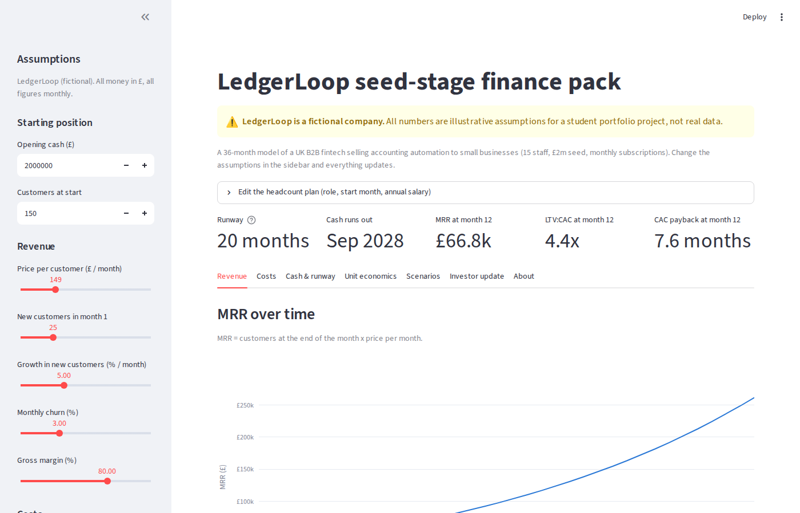
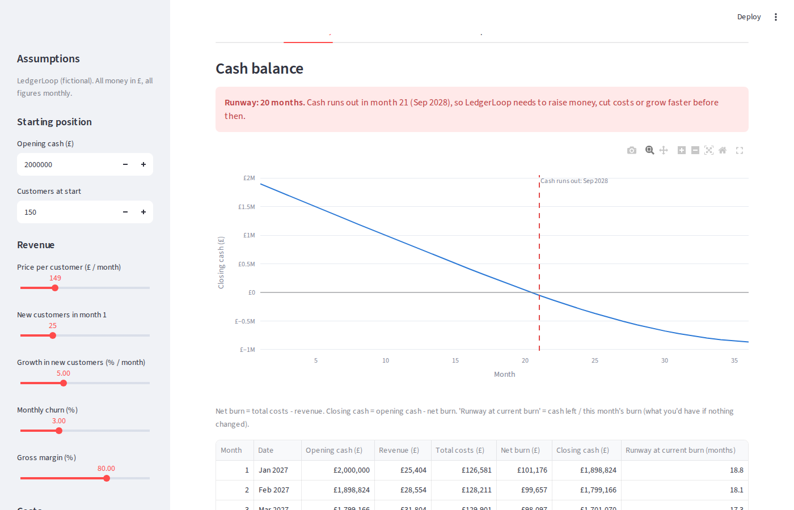
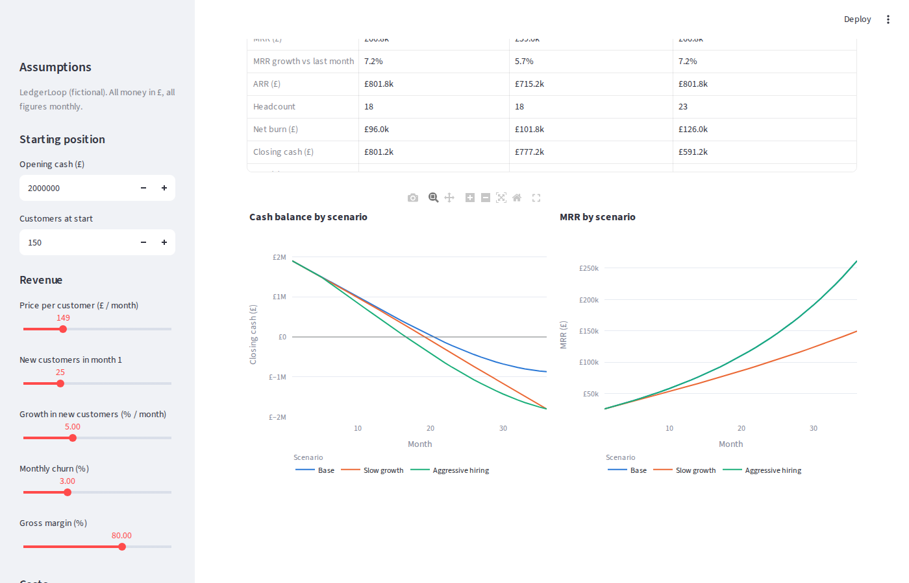
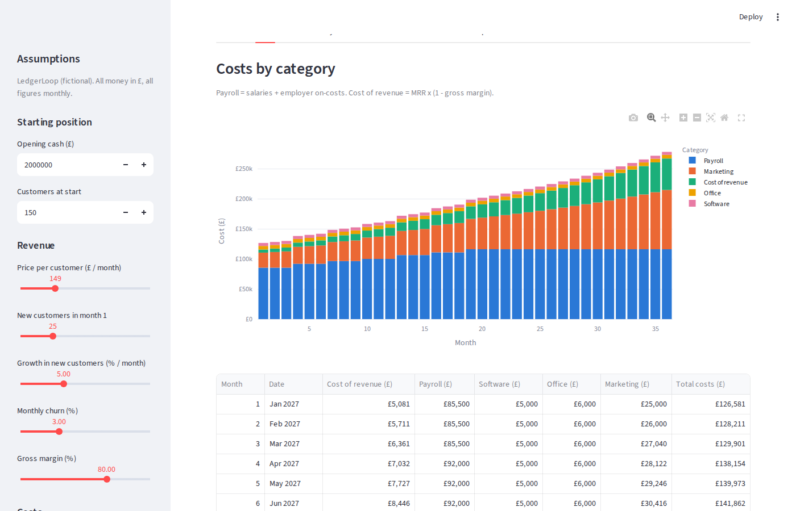
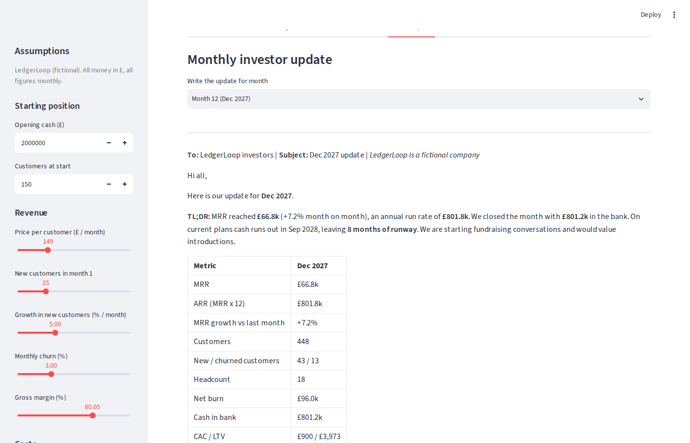

# LedgerLoop: Seed-Stage Startup Finance Pack

> ⚠️ **LedgerLoop is a fictional company.** All numbers are illustrative assumptions for a student portfolio project, not real data.

**▶ Try the live app: [ledgerloop-finance-pack.streamlit.app](https://ledgerloop-finance-pack.streamlit.app/)**

An interactive 36-month financial model of a seed-stage UK B2B fintech, built in Python with Streamlit. Move the sliders and the revenue, costs, cash runway, unit economics, scenarios and investor update all update instantly.



---

## The question

**LedgerLoop** (fictional) sells accounting automation software to UK small businesses on monthly subscriptions. It has **15 staff** and has just raised a **£2m seed round**.

> *How long will the money last, what drives that, and is each customer worth more than it costs to win?*

## Key findings (default assumptions)

| Metric | Result |
|---|---|
| **Runway** | **20 months**: cash runs out in month 21 (Sep 2028) |
| MRR at month 12 | £66.8k (about £800k ARR) |
| LTV:CAC | 4.0x in month 1, 4.4x by month 12 (benchmark: 3x or more) |
| CAC payback | 8.4 months (benchmark for SMB software: under 12) |

**Scenarios:**

| | Base | Slow growth (growth halved) | Aggressive hiring (+5 hires in month 6) |
|---|---|---|---|
| Runway | 20 months | 19 months | 16 months |

**Takeaways:**
1. **Hiring moves runway far more than growth does in the short term.** Five extra hires cost 4 months of runway, while halving growth costs 1. Costs are certain and immediate; revenue is uncertain and slow.
2. **Payroll is about two-thirds of costs**, so headcount is the main lever on burn.
3. **The company is not "default alive":** it is still burning cash at month 36, so it must raise a Series A. It only passes £1m ARR in month 16, about five months before the cash runs out. Fundraising should start around months 9–11.

## Screenshots

| Cash balance with the runway month marked | Scenarios side by side |
|---|---|
|  |  |
| **Costs by category** | **Auto-generated investor update** |
|  |  |

## What the app does

- **Revenue:** new customers, growth, price and churn give active customers and MRR.
- **Costs:** a headcount plan (role, start month, salary plus employer on-costs) and other monthly costs (software, office, marketing).
- **Cash and runway:** monthly burn, cash balance and the month the cash runs out.
- **Unit economics:** CAC, LTV, LTV:CAC and CAC payback.
- **Scenarios:** base, slow growth and aggressive hiring, side by side.
- **Investor update:** a one-page monthly update for any chosen month.
- **Sidebar controls** for every key assumption, plus an **editable headcount table**.
- **Download as Excel:** all monthly tables, one sheet per section.

## Method

The model runs **monthly for 36 months**. Units: GBP, monthly figures, percentages stored as decimals (5% = 0.05).

```
Customers at end   = customers at start − churned + new
Churned            = customers at start × monthly churn
New customers      = new in month 1 × (1 + growth)^(month − 1)
MRR                = customers at end × price

Payroll            = Σ (annual salary ÷ 12) × (1 + employer on-costs), for people who have started
Cost of revenue    = MRR × (1 − gross margin)
Total costs        = payroll + cost of revenue + software + office + marketing

Net burn           = total costs − MRR
Closing cash       = opening cash − net burn
Runway             = months fully paid for before closing cash goes below £0

CAC                = marketing spend ÷ new customers
LTV                = price × gross margin ÷ monthly churn
CAC payback        = CAC ÷ (price × gross margin)
```

## Default assumptions

All defaults live in [`assumptions.py`](assumptions.py), each with a comment explaining the reasoning.

| Assumption | Value | Reasoning (short) |
|---|---|---|
| Opening cash | £2,000,000 | The seed round |
| Customers at start | 150 | About £22k MRR, typical for UK seed-stage SaaS |
| Price | £149 / month | Above basic accounting tools (£15–60); saves £300+/month of bookkeeping |
| New customers, month 1 | 25 | About one per working day |
| Growth in new customers | 5% / month | About 80% a year |
| Monthly churn | 3% | About 31% a year; SMB benchmark 3–7% a month |
| Gross margin | 80% | Software 75–85%, less fintech data fees |
| Employer on-costs | 20% | UK employer NI (15%) + pension + benefits |
| Team | 15 now, 21 by month 19 | 6 planned hires (engineering, sales, customer success, marketing) |
| Software / office | £5,000 / £6,000 per month | Internal tools; London co-working |
| Marketing | £25,000 / month, +4% a month | Gives a £1,000 CAC in month 1 |

## Limitations

1. **New customers don't depend on marketing spend.** They follow a growth rate, so cutting marketing doesn't reduce sign-ups in the model.
2. **CAC counts marketing spend only.** Including sales and marketing salaries ("fully loaded" CAC) gives about £1,540 and an LTV:CAC of about 2.6x.
3. **Constant churn, price and margin.** There are no price rises, no cohort effects and no upsell (expansion) revenue.
4. **No pay rises, VAT, corporation tax or R&D tax credits.**
5. **Cash is collected in the same month as revenue** (monthly card billing). No annual prepayments or invoice terms.
6. **Customer numbers are expected averages,** so they can be fractions.

## Built with Claude Code

I built this project with **[Claude Code](https://claude.com/claude-code)**, Anthropic's AI coding assistant, which I used as both a builder and a tutor. We worked in stages: I chose and approved every assumption, checked the revenue and cash calculations by hand, and made sure I can explain every part of the model. The code is deliberately kept simple (plain functions, plain-English comments) so the finance logic can be read on its own.

## How to run it locally

You need Python 3.11 or newer.

```bash
git clone https://github.com/TCHINTTAM/Seed-stage-startup-finance-pack.git
cd Seed-stage-startup-finance-pack
python3 -m venv .venv
source .venv/bin/activate          # Windows: .venv\Scripts\activate
pip install -r requirements.txt
streamlit run app.py
```

The app opens at `http://localhost:8501`. To check the numbers without the app, run `python model.py`.

## Project structure

```
assumptions.py   Default assumptions, each with an explanation
model.py         All the finance calculations (plain functions, no app code)
app.py           The Streamlit app: sidebar, charts, scenarios, investor update, Excel export
requirements.txt Python libraries
docs/            Screenshots and a learning guide
```
